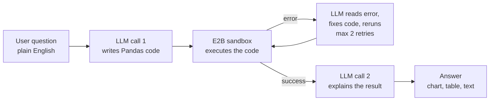

# Data Analysis Copilot

**Ask your data anything, in plain English. No code. No waiting.**

A conversational agent for exploratory data analysis. Upload a CSV or Excel file, ask questions in natural language, and get charts, tables, and plain-English explanations back in seconds. The agent writes and executes the Pandas code for you, safely, in an isolated cloud sandbox.

Built for **business analysts, students, and anyone who works with data but doesn't code**.

---

## Features

- **Natural language to code**: questions like *"Which region is most profitable?"* are translated into Pandas code automatically
- **Automatic visualization**: the agent picks the right output (chart, table, or single value) based on your question; no chart-type menus
- **Self-healing execution**: if generated code fails, the agent reads the error, fixes its own code, and reruns (up to 2 retries)
- **Secure sandbox**: LLM-generated code runs in an isolated [E2B](https://e2b.dev) cloud sandbox, never on your machine (with local fallback)
- **Multi-turn conversation**: follow-up questions like *"now plot that as a bar chart"* work, because the agent keeps conversation context
- **Data profiling on upload**: column types, ranges, null counts, and suggested starter questions the moment a file is loaded
- **Export**: download any chart as PNG or any result table as CSV with one click

## Quick Start

### 1. Clone and install

```bash
git clone https://github.com/ibrahimzarouri/data-analysis-copilot.git
cd data-analysis-copilot

python -m venv venv
# Windows:
venv\Scripts\activate
# macOS/Linux:
source venv/bin/activate

pip install -r requirements.txt
```

### 2. Configure API keys

Copy `.env.example` to `.env` and fill in your keys:

```bash
cp .env.example .env
```

| Variable | Required | Description |
|----------|----------|-------------|
| `API_KEY` | Yes | API key for the LLM endpoint (OpenAI-compatible) |
| `BASE_URL` | Optional | LLM endpoint URL (default: `https://chat-ai.academiccloud.de/v1`) |
| `MODEL` | Optional | Model name (default: `qwen3-coder-next`) |
| `E2B_API_KEY` | Optional | [E2B](https://e2b.dev) key for sandboxed code execution. Without it, code runs locally (see [Security](#security)) |

### 3. Run

```bash
streamlit run app.py
```

Upload a CSV/Excel file in the sidebar and start asking questions.

## Run with Docker

No Python or venv needed, just Docker and a filled-in `.env` file:

```bash
docker build -t data-analysis-copilot .
docker run --env-file .env -p 8501:8501 data-analysis-copilot
```

Then open `http://localhost:8501` in your browser.

The API keys are passed in at runtime via `--env-file`; they are never baked into the image (`.env` is excluded by `.dockerignore`).

## Example questions

- *"Show me monthly sales trend over the 3 years"*
- *"Which category is most profitable and which loses money?"*
- *"Is there a correlation between discount and sales?"*
- *"Show me the top 5 days by sales"*
- *"Plot that as a bar chart"* (follow-up: the agent remembers context)

## How it works

One question triggers **two LLM calls**: one to write code, one to explain results. Separating these two tasks produces better output on both.



1. **LLM call 1** receives the question plus an automatically generated dataset profile (column names, types, ranges, samples) and responds with a ```python code block.
2. **Execution**: the code is extracted and run in an E2B cloud sandbox where the DataFrame, pandas, matplotlib, and seaborn are pre-loaded. On error, the error text is sent back to the model, which returns fixed code (max 2 retries).
3. **Capture**: figures are transferred as base64 PNG, tables as CSV, plus raw stdout.
4. **LLM call 2**: the execution result is injected into the conversation and the model explains it in 2-4 plain sentences, with no code.

### Key design decisions

| Decision | Why |
|----------|-----|
| **Chart routing lives in the prompt, not in code** | No classifier, no if-statements. The system prompt defines when to draw a chart, return a table, or print a value. The model decides from question intent. |
| **Code-block extraction instead of tool_calls** | The code model reliably emits ```python blocks; extracting them with a regex proved more robust than function-calling for this model. |
| **Two separate LLM calls** | Writing precise code and explaining results are different tasks. Splitting them improves quality on both. |
| **Sandbox-first execution** | Executing LLM-generated code is a security risk by definition. E2B gives an isolated cloud VM with its own filesystem. |

## Project structure

```
├── app.py                  # Streamlit UI: chat, sidebar, downloads
├── agent/
│   ├── analyst.py          # DataAnalystAgent: two-call loop + self-healing retry
│   └── prompts.py          # System prompt with chart/table/value routing rules
├── tools/
│   ├── code_executor.py    # E2B sandbox wrapper + local exec fallback
│   └── data_loader.py      # CSV/Excel loading, profiling, question suggestions
├── requirements.txt
├── Dockerfile              # Container build (see Run with Docker)
├── .dockerignore           # Keeps secrets and local files out of the image
└── .env.example            # Template for API keys (copy to .env)
```

## Security

- **With `E2B_API_KEY` set** (recommended): all generated code runs in an isolated E2B cloud sandbox. Your machine never executes LLM output.
- **Without it**: code falls back to local `exec()` in the Streamlit process. This is fine for trusted demo data but not recommended for general use.
- API keys live only in `.env`, which is git-ignored and never committed.

## Tech stack

[Streamlit](https://streamlit.io) · [Pandas](https://pandas.pydata.org) · [Matplotlib](https://matplotlib.org) / [Seaborn](https://seaborn.pydata.org) · [E2B Code Interpreter](https://e2b.dev) · OpenAI-compatible LLM API (qwen3-coder via [Academic Cloud](https://chat-ai.academiccloud.de))

## Context

Developed as the semester project for the **Agentic AI** module (M.Sc. program), built across five sprints: research & architecture, data loading & exploration, natural language to code, visualization agent, conversational polish.

## Author

**Ibrahim Zarouri**
